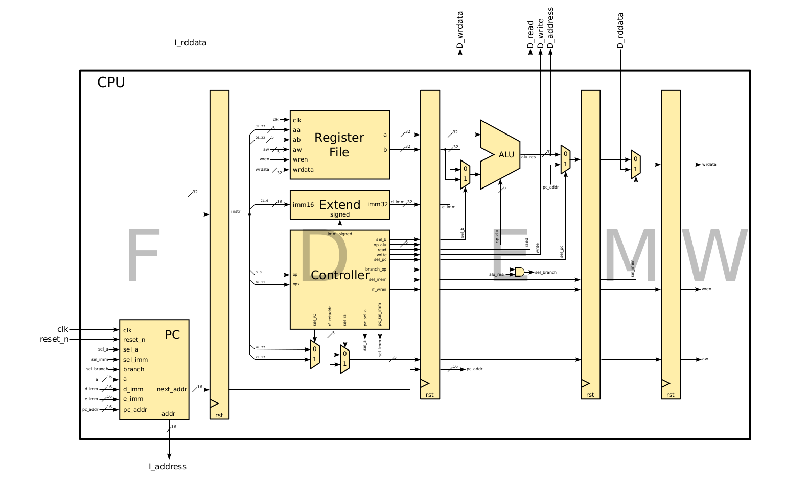

# Pipelined Nios II Processor

## Table of contents
* [Description](#description)
* [Architecture](#architecture)
* [Contributors](#contributors)

## Description

This project implements a simple pipelined version of the Nios II processor in VHDL. It was first developed for the course CS-208 Computer architecture and then extended (adding instruction level parallelism via the pipeline) for the course CS-209 Systems-on-Chip architecture taught at EPFL.

## Architecture

The CPU works with a simple 5-stage pipeline constituted of the Fetch, Decode, Execute, Memory and Writeback (F-D-E-M-W) stages. All the instructions go through these 5 stages, even if some of them are not used. There are no forwarding paths, stalls or flushes. Furthermore, the [Harvard architecture](https://en.wikipedia.org/wiki/Harvard_architecture) was chosen.  
The overall structure of the CPU looks as following.

## Contributors
[Squalene](https://github.com/Squalene), [loh0um](https://github.com/loh0um)
